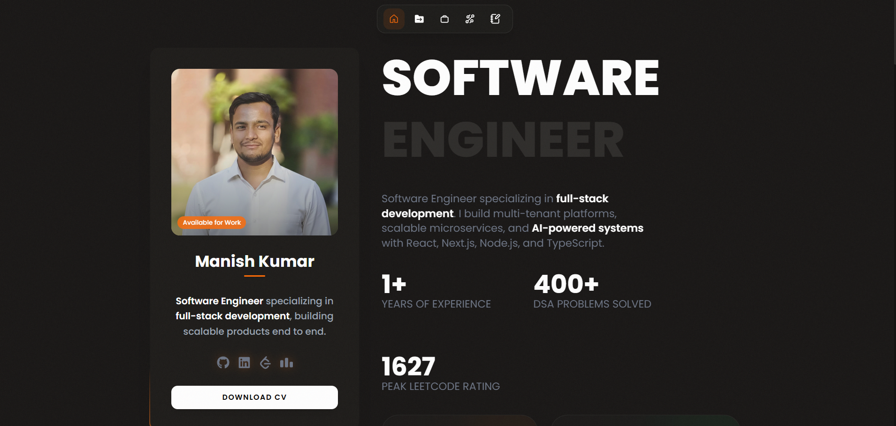

# Manish Kumar — Portfolio

A personal developer portfolio built with React 19, Vite, and Tailwind CSS v4. It features a single-page layout with an intro, recent projects, experience, skills, and a contact form, plus dedicated detail pages for individual projects and experiences.

## Preview



<p align="center">
  
  &nbsp;&nbsp;
  
</p>

## Tech Stack

- **React 19** with **React Router 7** for routing
- **Vite 7** for dev server and builds
- **Tailwind CSS v4** (via `@tailwindcss/vite`)
- **react-icons** for iconography
- **Formspree** for contact form submissions
- **ESLint 9** for linting

## Features

- Single-page home with smooth-scroll navigation and scroll-spy active section highlighting
- Reveal-on-scroll animations powered by `IntersectionObserver`
- Docking navbar that repositions on scroll
- Detail routes for projects (`/projects/:id`) and experience (`/experience/:id`)
- Content-driven sections — profile, skills, experiences, and projects live in `src/data/`
- Contact form wired to Formspree
- Image carousel with high-priority image preloading and skeleton shimmer loading

## Getting Started

### Prerequisites

- Node.js 18+ (recommended)
- npm

### Installation

```bash
npm install
```

### Environment Variables

Copy the example env file and fill in your Formspree form ID:

```bash
cp .env.example .env
```

```env
# The part after /f/ in your Formspree endpoint URL
VITE_FORMSPREE_ID=your_formspree_id
```

The contact form posts to `https://formspree.io/f/<VITE_FORMSPREE_ID>`.

### Development

```bash
npm run dev
```

Runs the app in development mode with hot module replacement. Vite prints the local URL (default `http://localhost:5173`).

## Scripts

| Command           | Description                          |
| ----------------- | ------------------------------------ |
| `npm run dev`     | Start the Vite dev server            |
| `npm run build`   | Build for production into `dist/`    |
| `npm run preview` | Preview the production build locally |
| `npm run lint`    | Run ESLint across the project        |

## Project Structure

```
Portfolio-2/
├── public/                 # Static assets (images, favicon)
├── src/
│   ├── Components/          # Reusable UI (Navbar, Sidebar, cards, carousel, etc.)
│   ├── Section/             # Home page sections (Intro, Skills, Experience, Contact, Footer...)
│   ├── Pages/               # Route pages (Home, ProjectDetail, ExperienceDetail)
│   ├── data/                # Content data (profile, skills, experiences, projects, contact)
│   ├── App.jsx              # Route definitions
│   └── main.jsx             # App entry point
├── .env.example
├── index.html
├── vite.config.js
└── package.json
```

## Editing Content

Most of the site is data-driven. Update these files to change what's displayed:

- `src/data/profile.js` — name, role, bio, stats, and social links
- `src/data/skills.jsx` — skills list
- `src/data/experiences.jsx` — work experience entries
- `src/data/projects.jsx` — projects shown on the home page and detail routes
- `src/data/contact.js` — contact form subject options and Formspree endpoint

## Building for Production

```bash
npm run build
npm run preview   # optional: verify the build locally
```

The static output in `dist/` can be deployed to any static host (Vercel, Netlify, GitHub Pages, etc.). Remember to set `VITE_FORMSPREE_ID` in your host's environment for the contact form to work.
